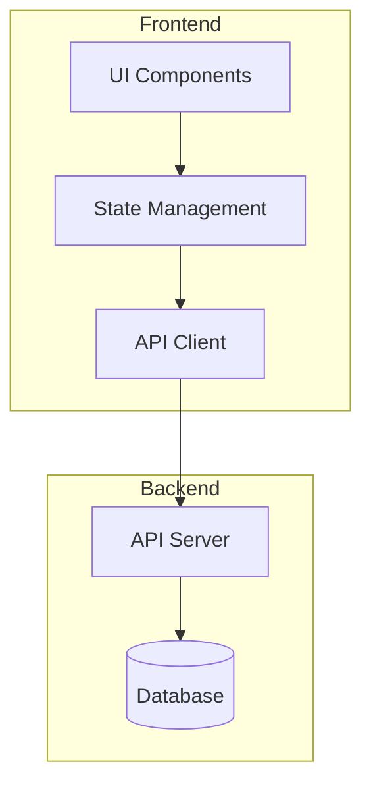
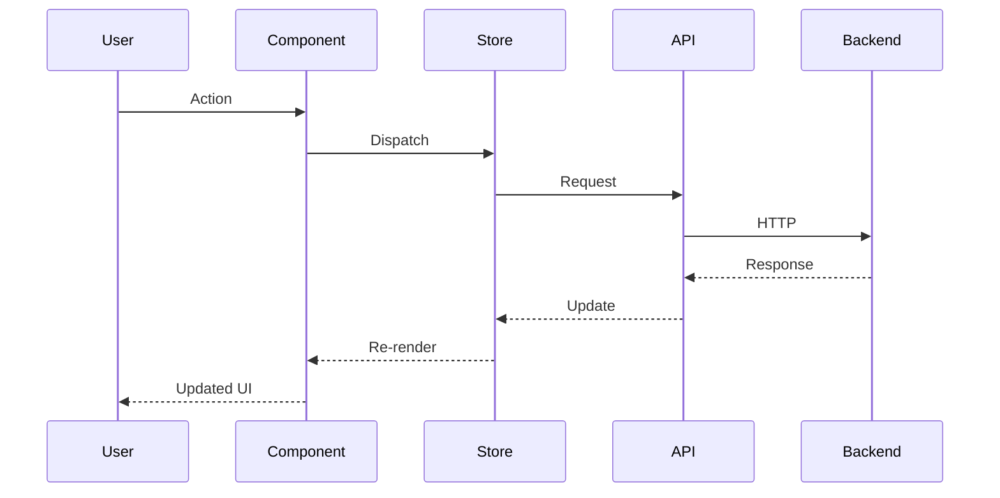

# Architecture Review Prompt

Use this template when the Tactician reviews or proposes system architecture.

---

## Architecture Review: {Feature/System Name}

### Review Info
- **Reviewer**: Tactician
- **Date**: {date}
- **Type**: New Feature / Refactor / System Design
- **Status**: Draft / In Review / Approved

---

## Executive Summary

{2-3 sentences summarizing the architecture and key decisions}

---

## Context

### Problem Statement

{What problem are we solving?}

### Current State

{Description of existing architecture, if applicable}

### Constraints

- **Technical**: {constraint}
- **Timeline**: {constraint}
- **Resources**: {constraint}
- **Dependencies**: {constraint}

---

## Proposed Architecture

### High-Level Design



### Components

| Component | Responsibility | Interface | Dependencies |
|-----------|----------------|-----------|--------------|
| {comp1} | {what it does} | {API/Props} | {deps} |
| {comp2} | {what it does} | {API/Props} | {deps} |

### Data Flow



### State Design

```typescript
interface FeatureState {
  // State shape
  items: Item[]
  loading: boolean
  error: Error | null
  
  // Actions
  fetchItems: () => Promise<void>
  addItem: (item: Item) => void
}
```

### API Design

| Endpoint | Method | Request | Response |
|----------|--------|---------|----------|
| /api/resource | GET | `{ filters }` | `{ data, meta }` |
| /api/resource | POST | `{ payload }` | `{ data }` |

---

## Design Decisions

### Decision 1: {Title}

**Options Considered:**

| Option | Pros | Cons |
|--------|------|------|
| A: {desc} | {+} | {-} |
| B: {desc} | {+} | {-} |

**Decision**: Option {X}

**Rationale**: {why}

### Decision 2: {Title}

{Same format}

---

## Quality Attributes

### Performance

- **Requirement**: {target latency, throughput}
- **Approach**: {caching, lazy loading, etc.}
- **Measurement**: {how we'll verify}

### Scalability

- **Requirement**: {expected load}
- **Approach**: {horizontal scaling, etc.}

### Maintainability

- **Approach**: {modular design, clear interfaces}
- **Documentation**: {where}

### Testability

- **Unit Tests**: {what}
- **Integration Tests**: {what}
- **E2E Tests**: {what}

### Security

- **Authentication**: {approach}
- **Authorization**: {approach}
- **Data Protection**: {approach}

---

## Implementation Plan

### Phase 1: Foundation
**Duration**: {time}
**Team**: {agents}

- [ ] Task 1
- [ ] Task 2

### Phase 2: Core
**Duration**: {time}
**Team**: {agents}

- [ ] Task 3
- [ ] Task 4

### Phase 3: Integration
**Duration**: {time}
**Team**: {agents}

- [ ] Task 5
- [ ] Task 6

---

## Risks

| Risk | Probability | Impact | Mitigation |
|------|-------------|--------|------------|
| {risk} | H/M/L | H/M/L | {plan} |

---

## Open Questions

- [ ] {Question 1}
- [ ] {Question 2}

---

## Approval

| Role | Agent | Status | Date |
|------|-------|--------|------|
| Architect | Tactician | ✅ Approved | {date} |
| Lead Dev | Di Scriptor | ⏳ Pending | - |
| Coordinator | Cartographer | ⏳ Pending | - |

---

## References

- [Related ADR](path/to/adr.md)
- [Design Doc](path/to/design.md)
- [External Reference](url)
