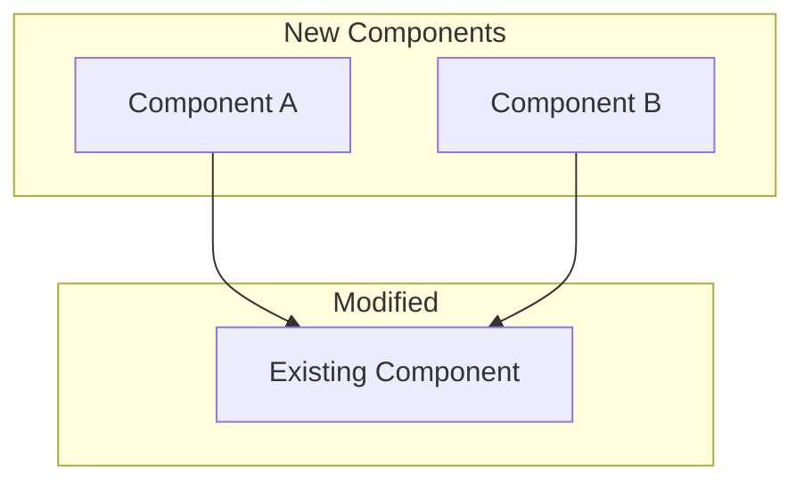

# Epic Planning Prompt

Use this template when the Cartographer plans a multi-sprint epic.

---

## 🗺️ Epic: {Epic Name}

### Epic Identity
- **ID**: EPIC-{number}
- **Owner**: Cartographer
- **Created**: {date}
- **Target Completion**: {date}

---

## Vision & Goals

### Vision Statement

{One paragraph describing what success looks like}

### Success Metrics

| Metric | Target | How to Measure |
|--------|--------|----------------|
| {metric1} | {target} | {method} |
| {metric2} | {target} | {method} |

### User Stories

As a {user type}, I want {goal} so that {benefit}.

1. As a **user**, I want...
2. As a **developer**, I want...

---

## Scope

### In Scope
- [ ] Feature 1
- [ ] Feature 2
- [ ] Feature 3

### Out of Scope
- {Excluded item 1}
- {Excluded item 2}

### Future Considerations
- {Item for future epic}

---

## Architecture Overview



### Technical Approach

{High-level description of implementation approach}

### Key Decisions Needed

- [ ] Decision 1: {options}
- [ ] Decision 2: {options}

---

## Team Assignment

### Crew Manifest

| Agent | Role | Allocation | Sprint Focus |
|-------|------|------------|--------------|
| Tactician | Architecture | 20% | S1: Design |
| Di Scriptor | Implementation | 80% | S1-S3: Build |
| Typescripter | Type Safety | 30% | S2: Types |
| Barkeep | QA | 40% | S3: Testing |
| StoriedScribe | Documentation | 20% | S3: Stories |

### Handoff Chain

```
Cartographer → Tactician → Di Scriptor → Barkeep → Archivist
     ↓              ↓            ↓           ↓
  Planning    Architecture  Implementation   QA
```

---

## Milestones & Timeline

### Sprint Plan

| Sprint | Theme | Deliverables | Status |
|--------|-------|--------------|--------|
| S1 | Foundation | {deliverables} | ⬜ Not Started |
| S2 | Core Features | {deliverables} | ⬜ Not Started |
| S3 | Polish & QA | {deliverables} | ⬜ Not Started |

### Milestone Breakdown

#### 🏁 Milestone 1: {Name} — Week {X}
- [ ] Task 1.1
- [ ] Task 1.2
- [ ] Task 1.3

#### 🏁 Milestone 2: {Name} — Week {X}
- [ ] Task 2.1
- [ ] Task 2.2

#### 🏁 Milestone 3: {Name} — Week {X}
- [ ] Task 3.1
- [ ] Task 3.2

---

## Dependencies

### Internal Dependencies

| Dependency | Owner | Status | ETA | Impact if Delayed |
|------------|-------|--------|-----|-------------------|
| {dep1} | {agent} | 🟢 Ready | - | - |
| {dep2} | {agent} | 🟡 In Progress | Week X | Blocks M2 |

### External Dependencies

| Dependency | Type | Status | Mitigation |
|------------|------|--------|------------|
| API v2 | External Team | 🟡 Pending | Mock data |
| Design Specs | Design Team | 🟢 Ready | - |

---

## Risks & Mitigations

| Risk | Probability | Impact | Mitigation | Owner |
|------|-------------|--------|------------|-------|
| {risk1} | High | High | {plan} | {agent} |
| {risk2} | Medium | Medium | {plan} | {agent} |

---

## Communication Plan

### Status Updates
- **Daily**: Stand-up in #{channel}
- **Weekly**: Progress report to stakeholders
- **Milestone**: Demo and review

### Escalation Path
1. Agent → Cartographer
2. Cartographer → {escalation point}

---

## Tracking

### Progress Log

| Date | Update | By |
|------|--------|-----|
| {date} | Epic created | Cartographer |

### Velocity Tracking

| Sprint | Committed | Completed | Velocity |
|--------|-----------|-----------|----------|
| S1 | - | - | - |
| S2 | - | - | - |
| S3 | - | - | - |
