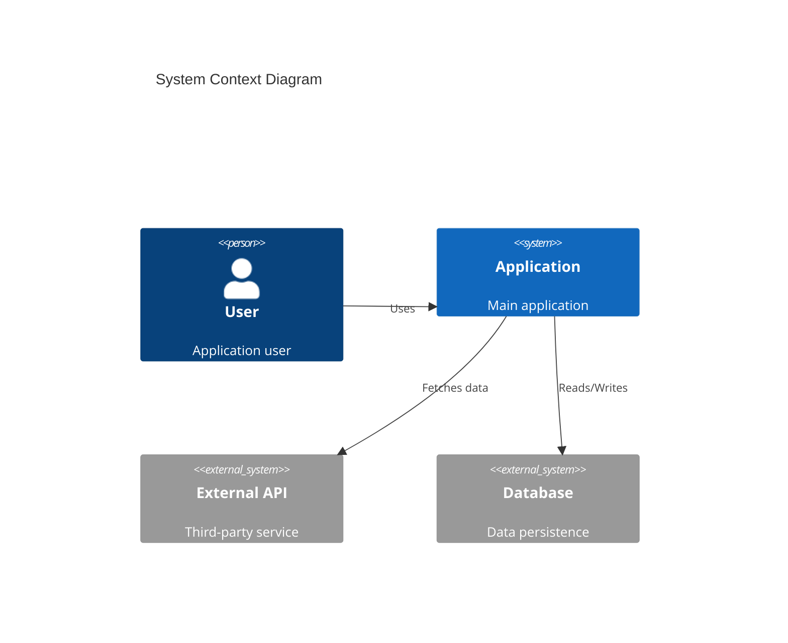
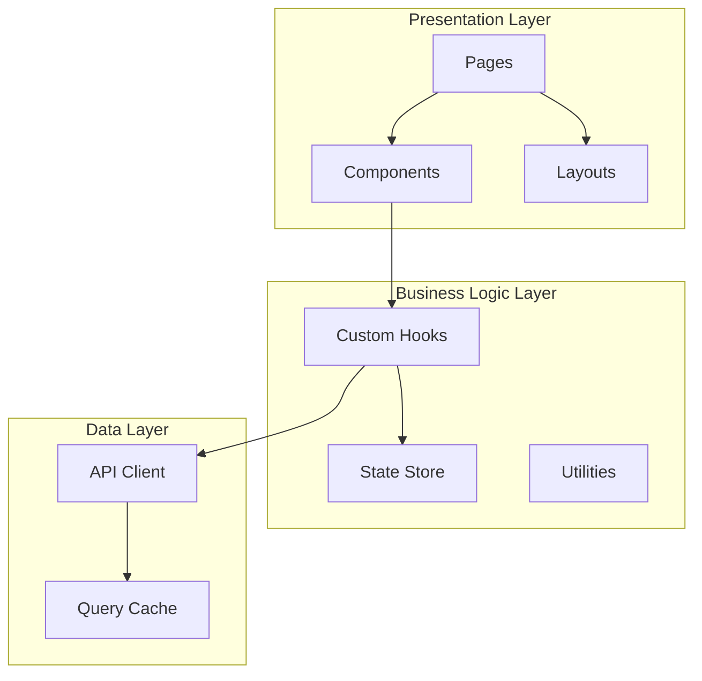
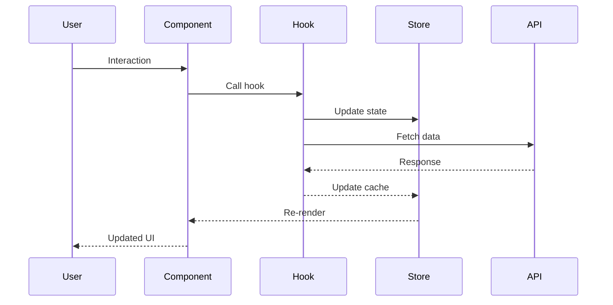

# Architecture & System Design Skill

## Overview

This skill provides expertise in system architecture, design patterns, and strategic technical planning for complex software projects.

## Core Competencies

### Architectural Patterns

- **Microservices**: Distributed systems, service boundaries
- **Monolithic**: Modular monoliths, layered architecture
- **Event-Driven**: Message queues, pub/sub patterns
- **Serverless**: FaaS patterns, cold starts, scaling

### Frontend Architecture

- **Component Architecture**: Atomic design, composition patterns
- **State Management**: Local vs global, derived state
- **Routing**: Code splitting, lazy loading, guards
- **Data Fetching**: Caching, optimistic updates, SSR/SSG

## Design Analysis Tools

### System Context Diagram



### Component Diagram



### Data Flow Diagram



## Planning Templates

### Feature Architecture Document

```markdown
# Feature: {Name}

## Overview

Brief description of the feature and its purpose.

## Requirements

### Functional
- [ ] Requirement 1
- [ ] Requirement 2

### Non-Functional
- [ ] Performance: {criteria}
- [ ] Accessibility: {criteria}
- [ ] Security: {criteria}

## Architecture

### Components
| Component | Responsibility | Dependencies |
|-----------|----------------|--------------|
| {Name} | {Description} | {Deps} |

### Data Flow
{Mermaid diagram or description}

### State Management
- Local State: {what}
- Global State: {what}
- Server State: {what}

## API Design

### Endpoints
| Method | Path | Description |
|--------|------|-------------|
| GET | /api/resource | Fetch resources |

### Types
\`\`\`typescript
interface FeatureData {
  id: string
  // ...
}
\`\`\`

## Implementation Phases

### Phase 1: Foundation
- [ ] Task 1
- [ ] Task 2

### Phase 2: Core Features
- [ ] Task 3
- [ ] Task 4

### Phase 3: Polish
- [ ] Task 5
- [ ] Task 6

## Risks & Mitigations

| Risk | Impact | Likelihood | Mitigation |
|------|--------|------------|------------|
| {Risk} | High/Med/Low | High/Med/Low | {Plan} |

## Open Questions

- [ ] Question 1
- [ ] Question 2
```

### Technical Decision Matrix

```markdown
## Decision: {Title}

### Options Considered

| Option | Pros | Cons | Effort |
|--------|------|------|--------|
| Option A | + Pro 1, + Pro 2 | - Con 1 | Low |
| Option B | + Pro 1 | - Con 1, - Con 2 | Medium |
| Option C | + Pro 1, + Pro 2, + Pro 3 | - Con 1 | High |

### Evaluation Criteria

| Criterion | Weight | Option A | Option B | Option C |
|-----------|--------|----------|----------|----------|
| Performance | 30% | 8 | 6 | 9 |
| Maintainability | 25% | 7 | 8 | 7 |
| Developer Experience | 20% | 9 | 7 | 6 |
| Time to Implement | 15% | 9 | 7 | 4 |
| Future Flexibility | 10% | 6 | 7 | 9 |
| **Weighted Score** | | **7.7** | **7.0** | **7.1** |

### Recommendation

{Selected option} because {reasons}.
```

### Refactoring Plan

```markdown
## Refactoring: {Area}

### Current State
{Description of current implementation and its problems}

### Target State
{Description of desired implementation}

### Strategy

#### Approach: {Strangler Fig / Big Bang / Incremental}

### Steps

1. **Preparation**
   - [ ] Add tests for existing behavior
   - [ ] Document current behavior
   
2. **Incremental Changes**
   - [ ] Step 1: {description}
   - [ ] Step 2: {description}
   
3. **Cleanup**
   - [ ] Remove old code
   - [ ] Update documentation

### Rollback Plan

If issues arise:
1. {Step 1}
2. {Step 2}

### Success Criteria

- [ ] All tests pass
- [ ] No performance regression
- [ ] Documentation updated
```

## Design Patterns Reference

### Component Patterns

```typescript
// Compound Component Pattern
const Card = ({ children }) => <div className="card">{children}</div>
Card.Header = ({ children }) => <div className="card-header">{children}</div>
Card.Body = ({ children }) => <div className="card-body">{children}</div>

// Render Props Pattern
const DataFetcher = ({ render, url }) => {
  const { data, loading } = useFetch(url)
  return render({ data, loading })
}

// Higher-Order Component Pattern
const withAuth = (Component) => (props) => {
  const { user } = useAuth()
  if (!user) return <Redirect to="/login" />
  return <Component {...props} user={user} />
}

// Custom Hook Pattern
const useToggle = (initial = false) => {
  const [value, setValue] = useState(initial)
  const toggle = useCallback(() => setValue(v => !v), [])
  return [value, toggle]
}
```

### State Management Patterns

```typescript
// Zustand Store Pattern
const useStore = create<State>((set, get) => ({
  items: [],
  addItem: (item) => set((state) => ({ items: [...state.items, item] })),
  removeItem: (id) => set((state) => ({ 
    items: state.items.filter(i => i.id !== id) 
  })),
  // Derived state via selectors
}))

// React Query Pattern
const useItems = () => useQuery({
  queryKey: ['items'],
  queryFn: fetchItems,
  staleTime: 5 * 60 * 1000,
})
```

## Best Practices

### Architecture Decisions

- ✅ Document significant decisions (ADRs)
- ✅ Consider scalability from the start
- ✅ Plan for testing at each layer
- ✅ Define clear boundaries between modules
- ✅ Use dependency injection for flexibility

### Planning

- ✅ Start with user needs, not technology
- ✅ Identify risks early
- ✅ Plan in phases with checkpoints
- ✅ Leave room for iteration
- ✅ Communicate trade-offs clearly
